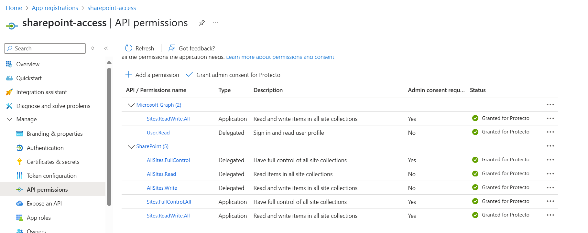

#  SharePoint Word Document Masking Script

This Python script downloads Word documents (`.docx`) from a specified SharePoint folder using Microsoft Graph API, processes each document to mask sensitive content asynchronously via a Mask API, and outputs the masked text while preserving paragraph structure. It also supports archiving or deleting processed files and logs its operations.

---

## Features

- Authenticate with Microsoft Graph API via Azure AD (MSAL) using client credentials.
- Download `.docx` files from a SharePoint document library folder.
- Split paragraphs into chunks of configurable maximum words.
- Send chunks to a Mask API asynchronously and poll for results.
- Preserve paragraph order and spacing in output text files.
- Archive or delete processed Word files.
- Configurable logging to file or console.
- Supports large documents and asynchronous API calls.

---


## Prerequisites

- Python 3.7+
- Azure AD App Registration with:
  - Client ID
  - Client Secret
  - Tenant ID
- Access to SharePoint site with necessary permissions to read files.
- Mask API base URL and authentication key.
- Required Python packages (install via pip):

```bash
pip install msal requests python-docx

```

##  Registration

To use Protecto's data protection and masking services, you need to register an account:

1. Visit the [Protecto Portal](https://portal.protecto.ai/).
2. Click on **Sign Up** and complete the registration form with your email and other details.
3. Once registered, log in to access your dashboard, You can find auth key and protecto API endpoint for masking/unmasking operations.

> 💡 Note: Keep your API token secure. It will be used to authenticate your requests to the Protecto API.

## Permissions Required

To enable the script to access SharePoint files and authenticate properly, your Azure AD application must be granted the following **Application permissions** as shown in the image below:



> **Note:** These permissions require **admin consent** in Azure AD to be granted.


## Configuration

Create a config file (e.g., config.ini) with the following structure:

```bash

[protecto]
BASE_URL = https://your-protecto-api-base-url
AUTH_KEY = your_protecto_auth_key
CLIENT_ID = your_azure_ad_app_client_id
CLIENT_SECRET = your_azure_ad_app_client_secret
TENANT_ID = your_azure_ad_tenant_id
USER_ID = target_user_principal_name_or_id
SITE_URL = optional_sharepoint_site_url_if_needed
 
 ```

BASE_URL — Base URL for the Protecto API.

AUTH_KEY — Bearer token or API key for Protecto API authentication.

CLIENT_ID, CLIENT_SECRET, TENANT_ID — Azure AD app credentials for Microsoft Graph authentication.

USER_ID — User ID or email whose OneDrive folder is accessed.

SITE_URL — Optional, not used in current script but reserved for SharePoint site if needed.

 ## Usage

 Run this script in your terminal:

 ```bash

 python mask_word_onedrive.py \
  --config_path config.ini \
  --onedrive_folder "FolderNameInOneDrive" \
  --local_download_dir "./downloads" \
  --output_dir "./masked_output" \
  [--log_file_path "./app.log"] \
  [--archive_dir "./archive"] \
  [--word_limit 500]

```
### Arguments

`--config_path (required)`: Path to the configuration file.

`--onedrive_folder (required)`: Name of the OneDrive folder inside the root directory to download files from.

`--local_download_dir (required)`: Local directory where downloaded Word files will be saved.

`--output_dir (required)`: Directory to save masked text output files.

`--log_file_path (optional)`: File path to save logs with daily rotation. Defaults to console logging.

`--archive_dir (optional)`: Directory to move processed Word files after masking. If not specified, original files are deleted.

`--word_limit (optional)`: Maximum number of words per chunk for masking API calls. Default is 500.

## How it works

`Authentication`: The script uses Azure AD app credentials to obtain an access token for Microsoft Graph API.

`File Listing & Download`: Lists all files in the specified OneDrive folder and downloads .docx files to a local directory.

`Paragraph Processing`: Loads each Word file and splits paragraphs into chunks if they exceed the word_limit.

`Masking API Calls`: Sends each chunk to the Protecto Mask API asynchronously, collecting tracking IDs.

`Polling Status`: Periodically polls the API for masking results and writes masked text chunks in order, preserving paragraph breaks.

`Post-processing`: Moves or deletes the original Word files as configured.

`Logging`: Logs progress, errors, and API responses.

## Logging

By default, logs print to the console.

Use `--log_file_path` to enable rotating log files (rotates daily, keeps 7 days).

Log format includes timestamps, log levels, and messages.

## Error Handling

Authentication failures, API errors, or download issues raise exceptions logged with error details.

Masking failures for chunks fallback to writing the original text chunk.

Invalid or empty paragraphs are handled gracefully to preserve formatting.

## Dependencies

`msal`: For Microsoft identity platform authentication.

`requests`: For HTTP requests.

`python-docx`: For Word document processing.

`Python standard libraries`: os, time, logging, shutil, argparse, json.

## Notes

Ensure your Azure AD app has proper delegated or application permissions for Microsoft Graph API to read OneDrive files.

Protecto API endpoint URLs may need adjustment depending on your subscription or environment.

Large Word documents with many paragraphs may take considerable time due to async masking and polling.